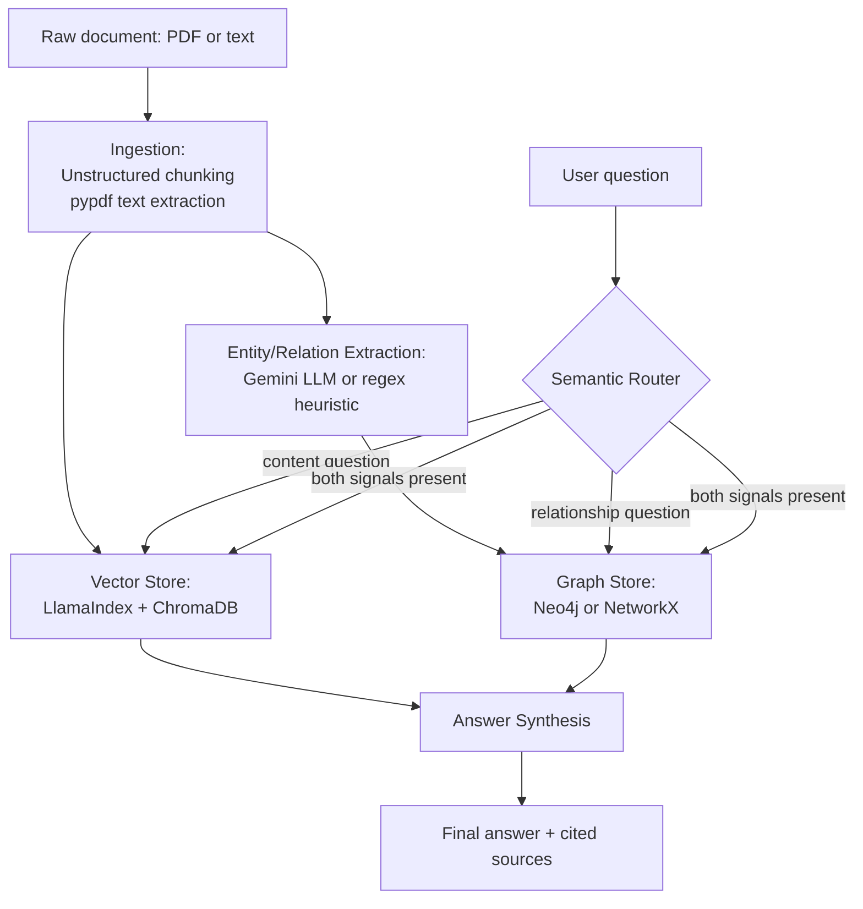

# Enterprise Knowledge-Graph RAG

A hybrid retrieval system that answers questions over messy corporate
documents (reports, memos, PDFs) using **both** vector similarity search
*and* knowledge-graph traversal — routing each question to whichever
retrieval strategy actually fits it, semantically.

**Tech stack:** LlamaIndex (indexing + query orchestration), ChromaDB
(vector store), Neo4j (knowledge graph — with a NetworkX offline fallback),
Unstructured (document chunking), Gemini (LLM for extraction/synthesis, with
a fully offline heuristic fallback everywhere it's used, called via the
Gemini SDK directly rather than LlamaIndex's Gemini wrapper — see
"A dependency decision worth knowing" below).

**What this proves:** real-world data-pipeline engineering — document
chunking, vector embeddings, entity/relationship extraction, and semantic
routing between two fundamentally different retrieval mechanisms — not just
"call an LLM with some context."

## The problem this solves

Plain vector-search RAG is good at "what does the document say about X" and
bad at "how is X connected to Y" — embeddings capture semantic similarity,
not relational structure. A question like *"who does John Smith report
to?"* has almost no useful vector-similarity signal (the answer, "Jane
Doe," doesn't share much vocabulary with the question), but it's a single
graph edge away in a knowledge graph built from the same document. This
project builds both indexes from the same source documents and **routes
each incoming question** to whichever one actually answers it — vector,
graph, or both.

## Architecture



## Project structure

```
Enterprise-KG-RAG/
├── README.md
├── main.py                  # CLI demo
├── pipeline.py               # shared ingest orchestration (CLI + API)
├── config.py                 # loads config/settings.yaml
├── llm_client.py             # direct Gemini SDK calls (see below for why)
├── requirements.txt
├── config/
│   └── settings.yaml         # model choice, routing keywords, relation patterns
├── ingestion/
│   ├── document_loader.py     # PDF/text extraction + Unstructured chunking
│   └── entity_extractor.py    # heuristic regex + Gemini LLM triple extraction
├── stores/
│   ├── embeddings.py          # deterministic offline hash embedding + Gemini switch
│   ├── vector_store.py        # LlamaIndex VectorStoreIndex over ChromaDB
│   └── graph_store.py         # Neo4j driver + NetworkX offline fallback
├── router/
│   └── query_router.py        # heuristic + optional LLM classification
├── rag/
│   └── query_engine.py        # route -> retrieve -> synthesize
├── api/
│   └── server.py              # FastAPI: /api/ingest, /api/query
├── frontend/                   # React (Vite) web UI
│   └── src/App.jsx
├── sample_data/
│   └── q3_report.txt          # sample messy corporate document
└── tests/                     # 18 tests, fully offline/deterministic
```

## The fallback pattern, used everywhere

Every external dependency in this project (the LLM, the embedding model,
the graph database) follows the same design: **try the real thing, fall
back to a deterministic offline substitute on any failure.**

| Component | Real (online) | Offline fallback |
|---|---|---|
| Entity/relation extraction | Gemini, structured JSON output | Regex-based relation patterns + generic co-occurrence |
| Vector embeddings | Gemini `text-embedding-004` | Deterministic hashing-trick bag-of-words vector |
| Knowledge graph | Neo4j (real Cypher queries) | In-memory NetworkX `MultiDiGraph` |
| Answer synthesis | Gemini, given retrieved context | Formatted context returned directly as the "answer" |
| Query routing | Gemini classification | Keyword-heuristic classifier |

This means the **entire pipeline runs, and the entire test suite passes,
with zero API keys and zero external services** — set `GOOGLE_API_KEY` and
`NEO4J_URI`/`NEO4J_USERNAME`/`NEO4J_PASSWORD` to swap in the real versions,
no code changes required.

## Setup

```bash
python -m venv .venv
source .venv/bin/activate        # Windows: .venv\Scripts\activate
pip install -r requirements.txt
```

### Optional: real LLM, embeddings, and graph database

```bash
export GOOGLE_API_KEY="AIza..."          # enables Gemini for extraction, routing, synthesis, and embeddings
export NEO4J_URI="neo4j+s://xxxx.databases.neo4j.io"
export NEO4J_USERNAME="neo4j"
export NEO4J_PASSWORD="..."
```

Neo4j AuraDB has a free tier if you want to test against a real graph
database without running one locally.

## Running it

### CLI demo

```bash
python main.py                          # ingests the sample report, runs 3 demo questions
python main.py --file my_report.pdf      # ingest your own PDF instead
python main.py --question "Who reports to Jane Doe?"
```

### API

```bash
uvicorn api.server:app --reload --port 8001
```

```bash
curl -X POST http://localhost:8001/api/ingest \
  -H "Content-Type: application/json" \
  -d '{"text": "...", "doc_id": "my-doc"}'

curl -X POST http://localhost:8001/api/query \
  -H "Content-Type: application/json" \
  -d '{"question": "Who does John Smith report to?"}'
```

The query response includes which route was chosen and why (`route`,
`route_reason`), the raw retrieved context from both stores
(`vector_sources`, `graph_triples`), and the synthesized `answer` — full
transparency into how the answer was produced, not just the final text.

### Full web app (backend + frontend)

The pipeline is also exposed as a FastAPI backend (`api/server.py`) with a
React frontend (`frontend/`) on top — a panel to ingest a document and a
panel to ask questions, showing which route was chosen and the raw
retrieved context (graph triples and/or vector chunks) alongside the
synthesized answer.

**1. Start the backend** (from the project root):
```bash
pip install -r requirements.txt
uvicorn api.server:app --reload --port 8001
```

**2. Start the frontend** (in a *second* terminal):
```bash
cd frontend
npm install
npm run dev
```
Open the URL it prints (usually `http://localhost:5173`). Click "Load
sample report", then "Ingest document", then ask a question.

### Deploying it publicly

- **Backend → Render** (free tier): create a new "Web Service" from your
  GitHub repo, root directory blank, build command `pip install -r requirements.txt`,
  start command `uvicorn api.server:app --host 0.0.0.0 --port $PORT`. Set
  `GOOGLE_API_KEY` (and the Neo4j env vars if used) in Render's dashboard.
- **Frontend → Vercel** (free tier): import the repo, set the project root to
  `frontend/`, and add an environment variable `VITE_API_URL` pointing at
  your Render backend's URL.
- **Note:** both the vector store and the graph store are in-memory in this
  project — they reset whenever the backend process restarts (a redeploy, or
  Render's free-tier spin-down after inactivity). Re-ingest a document after
  any restart before querying.

## Testing

```bash
pytest -v
```

18 tests, all offline. Notably, two real bugs were caught and fixed by this
suite during development (both still referenced in the test docstrings):

1. **Section headings merging into the next sentence's entity.** The
   sentence splitter originally collapsed all whitespace (including line
   breaks) before splitting on punctuation, so a heading like "Personnel
   Changes" (its own line, no period) ran straight into the next sentence,
   producing a garbage combined entity: "Personnel Changes John Smith."
   Fixed by treating line breaks as sentence boundaries first.
2. **Wrong subject picked in compound sentences.** For "John Smith was
   promoted to VP of Operations in September, **reporting to** CEO Jane
   Doe," taking the *nearest* capitalized word before "reporting to" picked
   up "Operations" (from the earlier clause) instead of the true subject,
   "John Smith." Fixed by taking the *first* entity in the sentence instead
   of the nearest one — English is overwhelmingly subject-first.

## A dependency decision worth knowing (good interview material)

This project calls the Gemini SDK **directly** (`llm_client.py`, via
`google-generativeai`) for text generation and embeddings, rather than
through `llama-index-llms-gemini` / `llama-index-embeddings-gemini`. That
wasn't the original design — it changed for a concrete reason:
`llama-index-llms-gemini==0.6.2` (its latest release) has a hard dependency
on `pillow<11`, and no version of Pillow below 11 ships a prebuilt Windows
wheel for Python 3.14 — installing it means compiling from source, which
needs a C compiler and zlib headers most machines don't have. Rather than
fight an unrelated image-processing library's version pin for a project
that never touches images, calling the underlying SDK directly sidesteps
the problem entirely and removes two dependencies. LlamaIndex is still used
for what it's actually good at here — the `VectorStoreIndex` over Chroma —
just not for the LLM/embedding call itself.

## Known limitations (be upfront about these in an interview)

- The heuristic entity extractor is a **regex pattern-matcher**, not a real
  NLP parser — it has no concept of grammar, coreference, or negation. It's
  good enough to demonstrate the pipeline and pass deterministic tests, but
  a real deployment would lean on the LLM extraction path (or a proper NER
  model) for anything production-grade.
- The offline hash embedding has no real semantic understanding — it
  proves the retrieval *pipeline* works (indexing, querying, ranking), not
  that the *embeddings* are semantically meaningful. Swap to Gemini's real
  embedding model for genuine semantic search.
- The router's keyword heuristic is a blunt instrument (root-substring
  matching) — it can misclassify ambiguous questions. The LLM classification
  path is meaningfully better and is used automatically whenever a key is
  configured.

## Extending this project

- Swap the offline hash embedding for a local sentence-transformers model
  to get real offline semantic search (no API key, but genuine embeddings).
- Add a proper NER model (spaCy, GLiNER) to the heuristic extraction path
  instead of regex, for a much stronger offline-only mode.
- Add a re-ranking step after vector retrieval (cross-encoder) for higher
  precision on the top-k results before synthesis.
- Persist the Chroma index to disk (`persist_directory` in
  `config/settings.yaml`) so ingested documents survive a restart.
